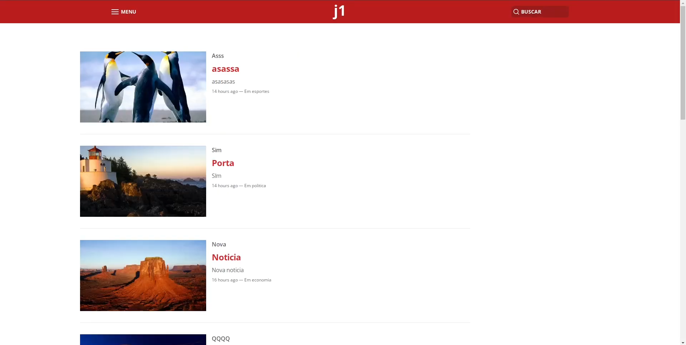
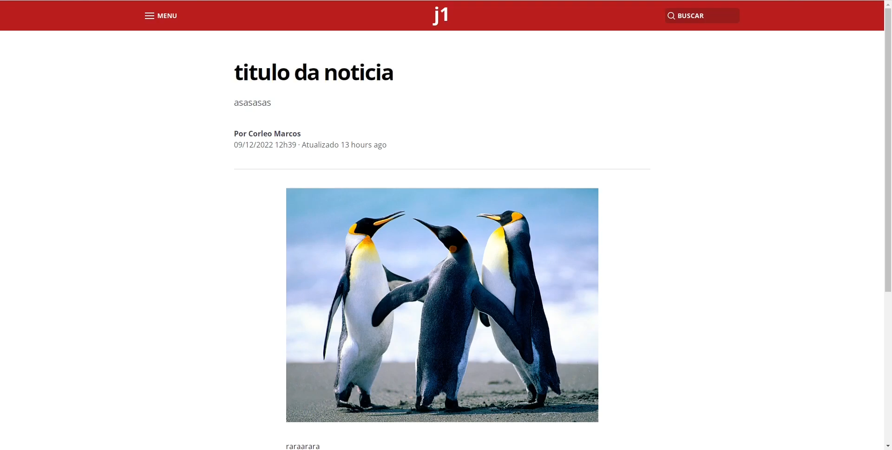

## Sobre
Projeto final desenvolvido na disciplina de Programação para Web II do curso de Sistemas para Internet - IFRS

Apresentação: https://www.youtube.com/watch?v=c8zaebpp-Sc

## Definição
O projeto final consiste dos estudantes implementarem um ou mais Web Service que funcionarão como um back-end para uma aplicação front-end de tema livre. Obrigatoriamente o back-end deve ser escrito em Java (tema da disciplina), porém, o front-end pode ser implementado com a linguagem/framework que o estudante se sentir mais confortável.

Tema escolhido:
Um site básico de notícias, com cadastro de usuários e área de comentários.

Requisitos:
- Cadastro de usuário
- Autenticação via JWT
- Adição de notícias para usuários com a role “Editor”. 
- Edição de notícias – se o usuário autenticado for o autor da notícia ou possuir a role “Administrador”
- Área de comentários visível apenas para usuários autenticados.
- Exibir uma lista com todas as notícias, com a possibilidade de filtrar por categoria.
- Busca de notícias por query.

## Descrição

### Back-end
Back-end feito utilizando o framework Quarkus (Java), integrando um microsserviço de imagens.

### Front-end
Front-end desenvolvido com Next.js, utilizando Tailwind CSS. Design "inspirado" no g1.

Como o front-end era opcional (não seria avaliado), aproveitei a oportunidade para aprender um pouco sobre TypeScript e o novo app-dir do Next.

## Prints

&nbsp;
&nbsp;
&nbsp;
&nbsp;
&nbsp;
&nbsp;

